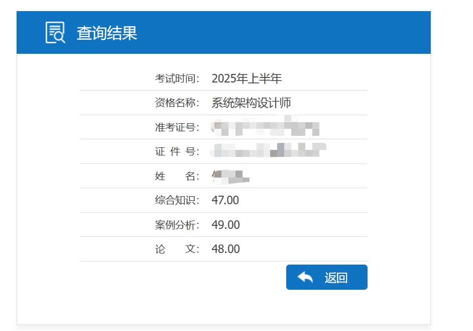
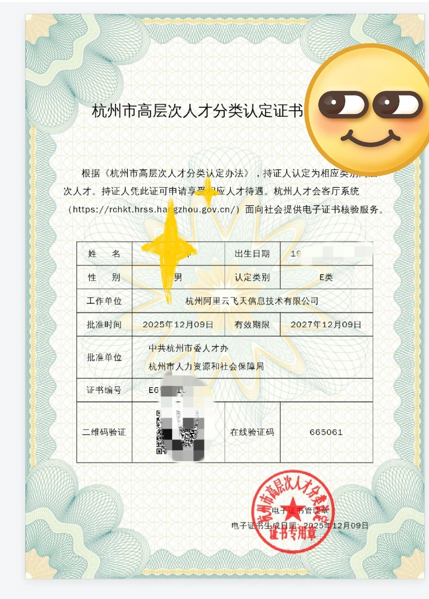
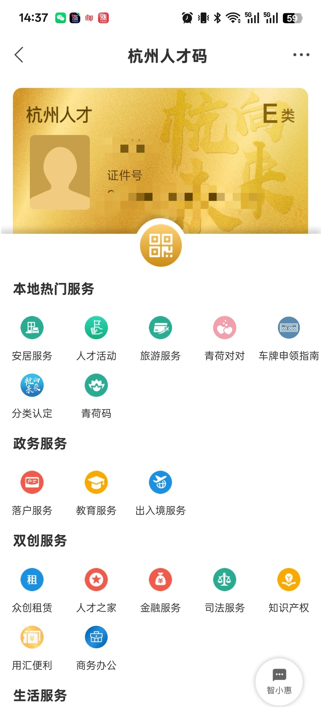

# 2025年上半年软考系统架构设计师备考指南

本仓库是我个人在2025年上半年成功通过软考系统架构设计师考试的全过程记录与经验总结。

## 考试目的

本次参加软考系统架构设计师考试，主要目的是为了申请杭州市E类人才认定。

## 成绩展示

## 人才认定

### 1. 杭州市 E 类人才认定流程（软考+论文）

> 详细见小红书经验贴：[挑战应届生最快拿下杭州 E 类人才](https://www.xiaohongshu.com/explore/6950f7e2000000001e009488?xsec_token=ABmnu7VluiksuDtbmMZnsjmMr0Jdj3Hvb8CwGYuBDxxKk=&xsec_source=pc_user&m_source=pwa)

- **个人条件组合**  
  - 以软考系统架构设计师成绩 + 学术论文组合申报 E 类人才。  
  - 软考电子版证书即可，无需纸质原件。  
  - 论文需要：
    - 学校图书馆开具的检索证明（电子版即可）；  
    - 论文全文电子版。
- **企业预审**  
  - 先与公司 HR 沟通，确认公司具备为员工申报 E 类人才的资质，并愿意配合申报。  
  - 在正式网上申报前，由企业在系统中进行预审、信息填写和材料初审，HR 一般会给到需要准备的材料清单。
- **线上申报与政府审批**  
  - 在企业预审通过后，由企业端在人才系统中发起正式申报，个人配合提供电子材料（证书、论文及检索证明等）。  
  - 提交后即进入区/市人社部门审批流程，一般需要等待几天到一两周不等。  
  - 经验贴案例：周四（4 号）提交申请，次周周二（9 号）即通过审批。
- **认定结果与市民卡变更**  
  - 审批通过后，杭州市民卡 App/小程序中的人才身份会更新为 E 类。  
  - 人才礼包（如“青荷礼包”）会出现在 E 类人才专属界面中，可按指引领取和使用。

### 2. 余杭区 E 类人才租赁补贴流程

> 详见小红书经验贴：[余杭区 E 类人才租房补贴注意事项](https://www.xiaohongshu.com/explore/696e1cfb000000000b0089a5?xsec_token=ABfnnsFLlN4wX5dA4GqNJW9deDmfrWcXgBxD1RLyeKNDo=&xsec_source=pc_user&m_source=pwa)

- **前置条件确认**  
  - 已完成杭州市 E 类人才认定，且工作、租房地点在余杭区。  
  - 租房合同真实有效，房东或公寓愿意配合办理备案。
- **房屋租赁备案（浙里办）**  
  - 提前在 `浙里办` 中完成房屋租赁备案：  
    - 与房东/公寓确认是否支持线上备案；  
    - 按要求在线提交租赁合同、身份证等信息。
  - 备案是后续申请租赁补贴的前置条件，务必提前办好。
- **是否需要居住证**  
  - 部分城区申请租赁补贴需要居住证；  
  - 经验贴中实测：余杭区申请租赁补贴时**不强制要求居住证**，但具体以当年官方政策为准，如有条件建议顺便办理人才引进居住证以备不时之需。
- **申请入口差异（市民卡 vs 企业端）**  
  - 其他城区：通常可以在杭州市民卡 App 的“安居服务”中自行发起租赁补贴申请；  
  - 余杭区：**无法通过市民卡个人端直接申请**，需要由企业通过内部系统代为申报。
- **通过企业系统发起申请**  
  - 告知 HR 自己已具备 E 类人才资格和房屋备案信息，确认公司是否已在余杭区相关系统中备案。  
  - 由企业在“企业端人才系统”中提交租赁补贴申请（通常 HR 或专人操作）。  
  - 申请提交后，个人端无法实时查看进度，整体流程相对“黑盒”，需要耐心等待。
- **审批周期与补贴到账**  
  - 经验贴显示：余杭区一般在**次月 10 号左右集中审批**上一轮申请。  
  - 示例：12 月提交申请，次年 1 月 14 日补贴到账，整体到账速度较快。  
  - 建议：保留好租金支付记录、合同和备案截图，以便遇到异常时与公司或相关部门核实。

> 以上内容基于公开经验贴总结，具体政策（认定标准、补贴额度、审批周期等）可能会随时间调整，办理前建议以杭州市及余杭区人社部门、人才平台当期官方通知为准。

---

## 备考规划

### 1. 备考周期

总备考时长为两个月（2025.3.19 - 2025.5.24），但建议尽早开始，战线可以适当拉长，不必过于紧凑。

### 2. 学习计划

- **选择题** (约100小时): 建议花费25天，每天投入4小时进行录播课程学习和刷题。
- **案例分析** (约70小时): 建议花费17天，每天4小时，重点研究历年真题。
- **论文** (4月份开始): 论文需要提前构思和准备，建议在4月份开始，准备3-5个不同技术方向的模板。

## 核心知识点

### 1. 知识笔记

本仓库包含了两个核心的知识点总结：

- [希赛-系统架构设计师笔记](知识大纲笔记/希赛-系统架构设计师.md): 这份笔记详细记录了备考过程中的关键知识点，并配有图解，非常适合用于系统性复习。
- [文老师大纲](知识大纲笔记/文老师/文老师大纲.md): 这份大纲清晰地标明了选择题、案例题和论文的考试重点，可以帮助你快速把握复习的重心。

### 2. 关键领域

根据我的备考经验，以下几个领域是考试的重中之重：

- **Redis**: 相关内容几乎必考。
- **软件架构风格**: 需要熟悉各种架构风格的特点和应用场景，考试可能会考原图。
- **AI相关内容**: 近年来AI热度很高，需要多加关注。
- **边缘计算与云边协同**: 这是我本次案例分析的高分关键，建议深入理解。

## 题型攻略

### 1. 选择题

选择题的复习要以“广”为主，覆盖所有知识点。推荐使用以下在线题库进行练习：

- [软考达人](https://ruankaodaren.com/exam)
- [希赛题库](https://wangxiao.xisaiwang.com/tiku2/list-dp131.html)

### 2. 案例分析

案例分析是考试的难点，需要重点投入时间。建议多刷历年真题，掌握答题技巧。

- [51CTO题库](https://t.51cto.com/list/years/sub-240)
- [希赛题库](https://wangxiao.xisaiwang.com/tiku2/list-zt131-1.html?1=1)

### 3. 论文

论文是系统架构设计师考试的一大特色，也是很多人容易失分的地方。我的建议是：

- **提前准备**: 千万不要等到最后才开始准备论文。至少提前一个月开始构思和写作。
- **准备多个模板**: 准备3-5篇不同技术方向的论文模板，以应对不同的考题。
- **紧扣主题**: 考试时如果遇到没有准备过的题目，要尽量往自己熟悉的技术方向上靠，但一定要注意审题，紧扣主题。

## 应试技巧与心得

- **教材为王**: 《考试32小时通关-第2版》这本书非常有用，建议多看几遍。
- **论文不要慌**: 即使遇到陌生的论文题目，也要沉着冷静，结合自己的知识储备进行分析和阐述。例如，我当时遇到的“事件驱动的架构风格”这个题目，虽然没听说过，但我把它往熟悉的微服务架构上靠，也拿到了不错的分数。
- **心态要好**: 软考的通过与否有一定运气成分。一次没过不要灰心，总结经验，下次再战！

## 备考资源

- **教材**: [2. 彩色 考试32小时通关-第2版（2024).pdf](2.%20彩色%20考试32小时通关-第2版（2024).pdf)
- **论文资料**:
  - [论文专题资料](论文/06-07.论文专题.pdf)
  - [历年论文真题](论文/)
  - [论文模板](论文/论文模板-互动课堂.docx)
- **案例分析资料**: [历年真题及练习](案例分析/)

希望这份备考指南能对你有所帮助，祝你考试顺利！