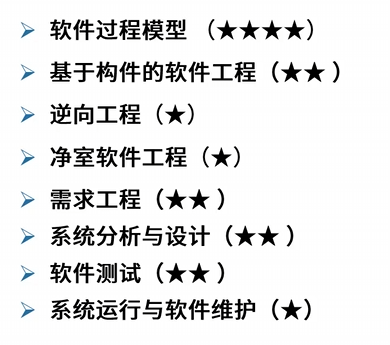
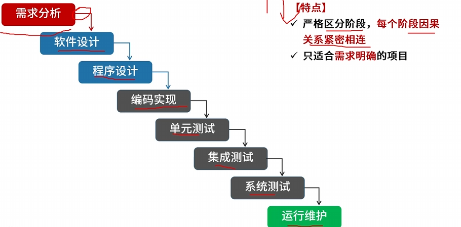
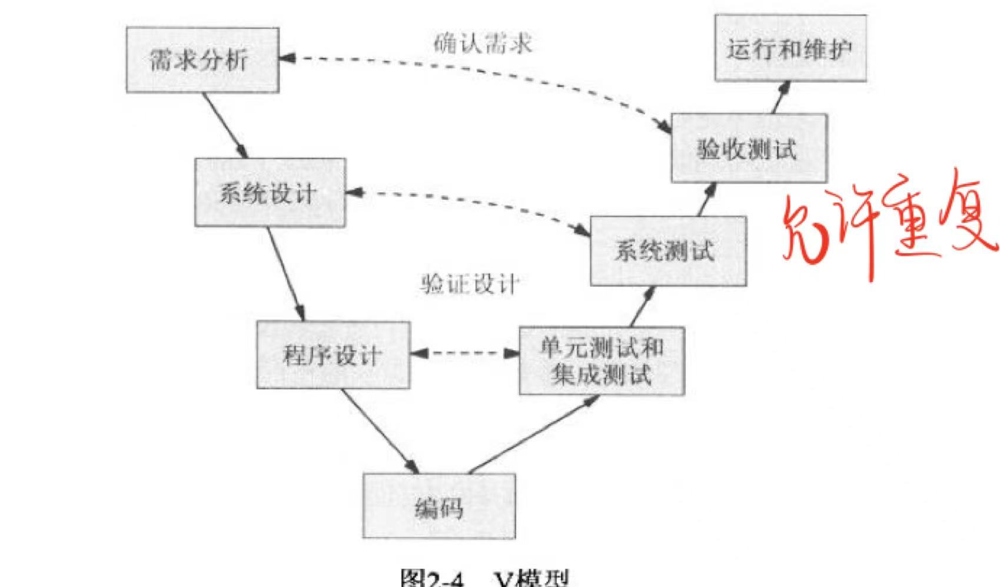
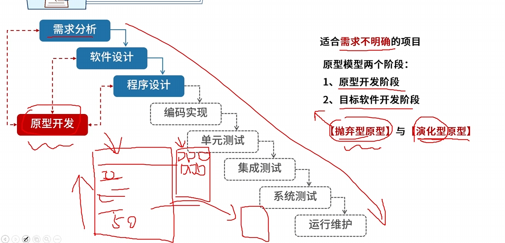
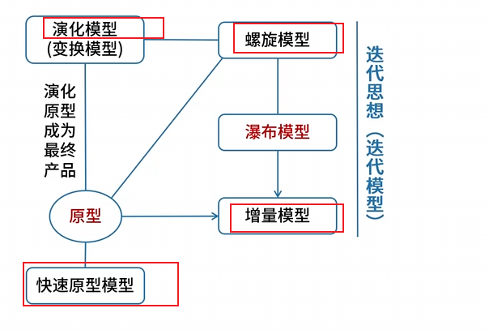
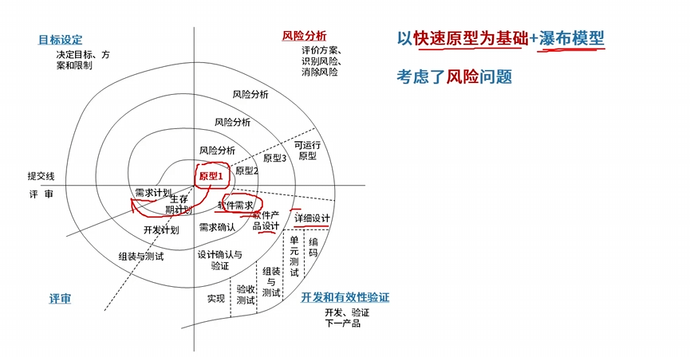
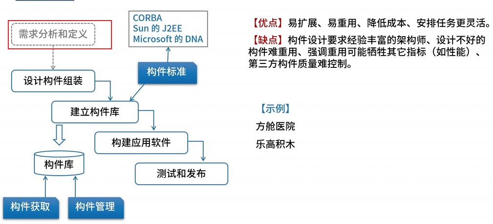
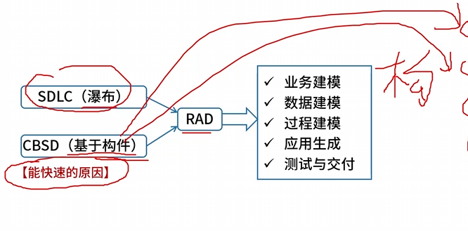
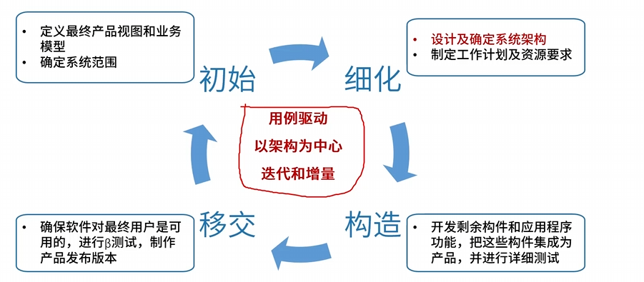

# 1.考试介绍及备考攻略

## 1.1 软件工程

章节内容概况

·

### 1.1.1 软件过程模型

- **瀑布模型**
  - 
  - 缺点
    - 软件需求完整性、正确性难确定
    - 严格串行化，很长时间才能看到结果
    - 瀑布模型要求每个阶段一次性完全解决该阶段工作，这不现实
- V模型（测试贯穿于始终）
  - 
- **原型模型**
  - 
  - 原型及相关模型
- **螺旋模型**
  - 
  - 四个象限：目标设定、评审、开发和有效性验证、风险分析
- 构件组装模型/基于构件的软件工程（CBSE）
  - 
- 快速应用开发模型（RAD）
  - 
- 统一过程（UP）
  - 
  - 
- 敏捷开发方法

